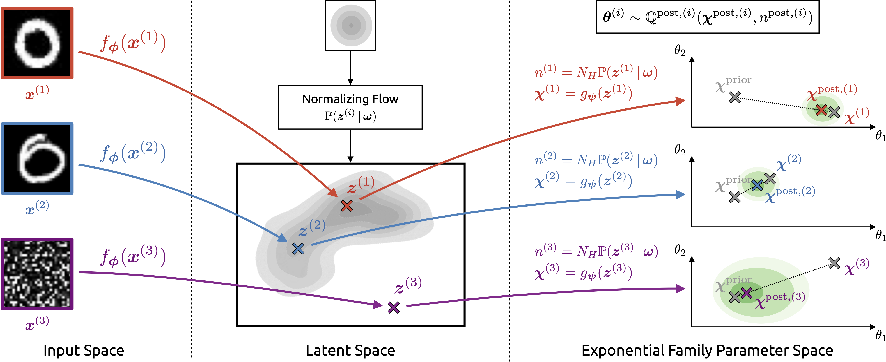

# Natural Posterior Network

This repository provides the official implementation of the Natural Posterior Network (NatPN) and
the Natural Posterior Ensemble (NatPE) as presented in the following paper:

[Natural Posterior Network: Deep Bayesian Predictive Uncertainty for Exponential Family Distributions](https://arxiv.org/abs/2105.04471)<br>
Bertrand Charpentier*, Oliver Borchert*, Daniel Zügner, Simon Geisler, Stephan Günnemann<br>
_International Conference on Learning Representations, 2022_

[Paper](https://arxiv.org/abs/2105.04471) | [Video](https://youtu.be/qMtpK0ECD8c)



## Features

The implementation of NatPN that is found in this repository provides the following features:

- High-level estimator interface that makes NatPN as easy to use as Scikit-learn estimators
- Simple bash script to train and evaluate NatPN
- Ready-to-use [PyTorch Lightning](https://www.pytorchlightning.ai) data modules with 8 of the 9
  datasets used in the paper\*

In addition, we provide a
[public Weights & Biases project](https://wandb.ai/borchero/natural-posterior-network). This
project will be filled with training and evaluation runs that allow you (1) to inspect the
performance of different NatPN models and (2) to download the model parameters. See the
[example notebook](./examples/pretrained.ipynb) for instructions on how to use such a pretrained
model.

_\*The Kin8nm dataset is not included as it has disappeared from the
[UCI Repository](http://archive.ics.uci.edu/ml/index.php)._

## Installation

Prior to installation, you may want to install all dependencies (Python, CUDA, Poetry). If you are
running on an AWS EC2 instance with Ubuntu 20.04, you can use the provided bash script:

```bash
sudo bash bin/setup-ec2.sh
```

In order to use the code in this repository, you should first clone the repository:

```bash
git clone git@github.com:borchero/natural-posterior-network.git natpn
```

Then, in the root of the repository, you can install all dependencies via
[Poetry](https://python-poetry.org):

```bash
poetry install
```

## Quickstart

### Shell Script

To simply train and evaluate NatPN on a particular dataset, you can use the `train` shell script.
For example, to train and evaluate NatPN on the Sensorless Drive dataset, you can run the following
command in the root of the repository:

```bash
poetry run train --dataset sensorless-drive
```

The dataset gets downloaded automatically the first time this command is called. The performance
metrics of the trained model is printed to the console and the trained model is discarded. In order
to track both the metrics and the model parameters via [Weights & Biases](https://wandb.ai), use
the following command:

```bash
poetry run train --dataset sensorless-drive --experiment first-steps
```

To list all options of the shell script, simply run:

```bash
poetry run train --help
```

This command will also provide explanations for all the parameters that can be passed.

### Estimator

If you want to use NatPN from your code, the easiest way to get started is to use the
Scikit-learn-like estimator:

```python
from natpn import NaturalPosteriorNetwork
```

The documentation of the estimator's `__init__` method provides a comprehensive overview of all the
configuration options. For a simple example of using the estimator, refer to the
[example notebook](./examples/estimator.ipynb).

### Module

If you need even more customization, you can use `natpn.nn.NaturalPosteriorNetworkModel` directly.
The `natpn.nn` package provides plenty of documentation and allows to configure your NatPN model as
much as possible.

Further, the `natpn.model` package provides PyTorch Lightning modules which allow you to train,
evaluate, and fine-tune models.

## Running Hyperparameter Searches

If you want to run hyperparameter searches on a local Slurm cluster, you can use the files provided
in the [sweeps](./sweeps) directory. To run the grid search, simply execute the file:

```bash
poetry run python sweeps/<file>
```

To make sure that your experiment is tracked correctly, you should also set the `WANDB_PROJECT`
environment variable in a place that is read by the slurm script (found in `sweeps/slurm`).

Feel free to adapt the scripts to your liking to run your own hyperparameter searches.

## Citation

If you are using the model or the code in this repository, please cite the following paper:

```bibtex
@inproceedings{natpn,
    title={{Natural} {Posterior} {Network}: {Deep} {Bayesian} {Predictive} {Uncertainty} for {Exponential} {Family} {Distributions}},
    author={Charpentier, Bertrand and Borchert, Oliver and Z\"{u}gner, Daniel and Geisler, Simon and G\"{u}nnemann, Stephan},
    booktitle={International Conference on Learning Representations},
    year={2022}
}
```

## Contact Us

If you have any questions regarding the code, please
[contact us via mail](mailto:borchero@in.tum.de?cc=charpent@in.tum.de&subject=Natural%20Posterior%20Network%20GitHub).

## License

The code in this repository is licensed under the [MIT License](./LICENSE).
